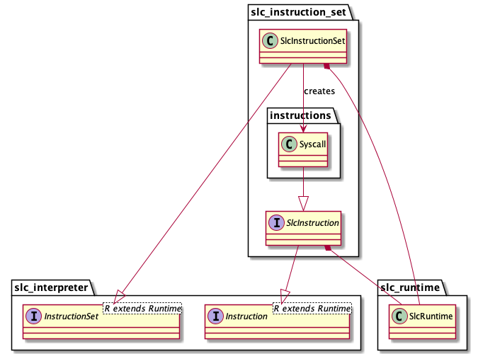

# SLC Instruction Set

## Dependencies

- `slc_runtime.SlcRuntime`
- `slc_interpreter.InstructionSet`
- `slc_interpreter.Instruction`

## Description

This module provides an implementation for the `slc_interpreter.InstructionSet` and `slc_interpreter.Instruction` generic interfaces, for the specific runtime `slc_runtime.SlcRuntime`. The module includes a `SlcInstructionSet` component that represents a factory that creates instruction executors, and implementations of `slc_interpreter.Instruction`, like `Syscall`, each representing a specific instruction executor.

## Design

