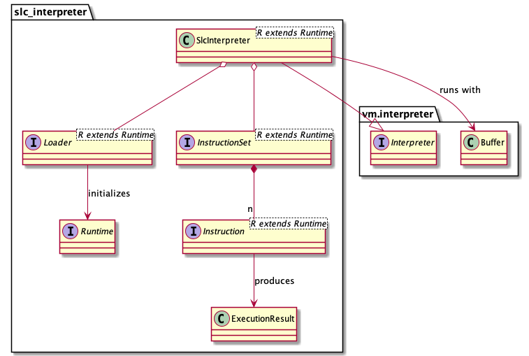

# SLC Interpreter

## Dependencies
- `vm.interpreter.Interpreter`
- `vm.interpreter.Buffer`

## Description

This module provides an implementation for `vm.interpreter.Interpreter`, representing a virtual machine interpreter:
- all details of the virtual machine's runtime architecture are abstracted under the `Runtime` component, thus supporting any runtime architecture (with or without registers, stack, etc.) and instruction set
- instructions are read directly from the given program `vm.interpreter.Buffer`, without storing it in any virtual memory: this will make it not possible for this interpreter to execute self-modifying programs
- there is a `Loader` component, which will just delegate the `Runtime` component to store the context arguments: since the program is directly read from the given `vm.interpreter.Buffer`, it makes no sense to have it stored in the virtual machine memory as well
- the instruction size is fixed, and provided by a configuration component
- there is no IP, nor IR registers, instead they're replaced by local variables for simplicity
- jumps and exit instructions are supported
- jumps and exit signals are not modeled with any domain mechanism, instead a simple `ExecutionResult` object is used
- if no exit instruction is provided by the program, the execution will terminate with exit code `0` after reaching the last instruction of the program

## Design

