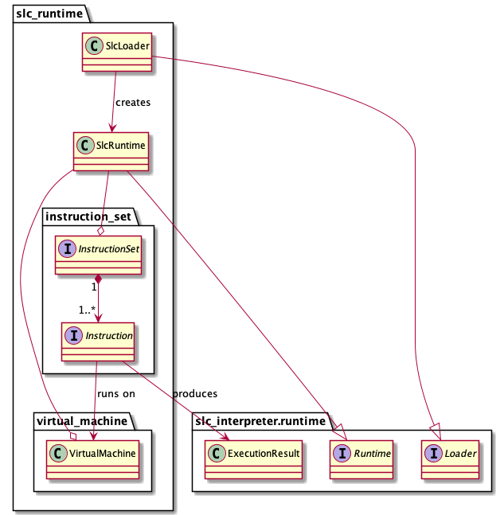

# SLC Runtime

## Dependencies

- `slc_interpreter.runtime.Runtime`
- `slc_interpreter.runtime.Loader`
- `slc_interpreter.runtime.ExecutionResult`

## Description

This module provides implementations for the `slc_interpreter.runtime` port, including a `SlcRuntime` component, that provides a facade for executing instructions, and a `SlcLoader` component, that creates runtime instances every time a program is executed. A `virtual_machine.VirtualMachine` component is provided to define the actual virtual machine inner parts, like registers, memory, etc., on which the programs have to be actually executed. An `instruction_set` port is provided, including `Instruction`, representing each instruction of the virtual machine's instruction set, and `InstructionSet`, representing the collection of all instructions:
- instructions are decoded always taking only the first byte as opcode
- the virtual machine uses only basic registers for data
- the virtual machine supports static memory, stack and heap
- the loader loads the runtime arguments onto the stack
- communication with the system should also be handled, for example working with files, etc., except for process and threads handling, which is instead taken care of by the clients that pass each instruction to the runtime

## Design

